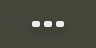
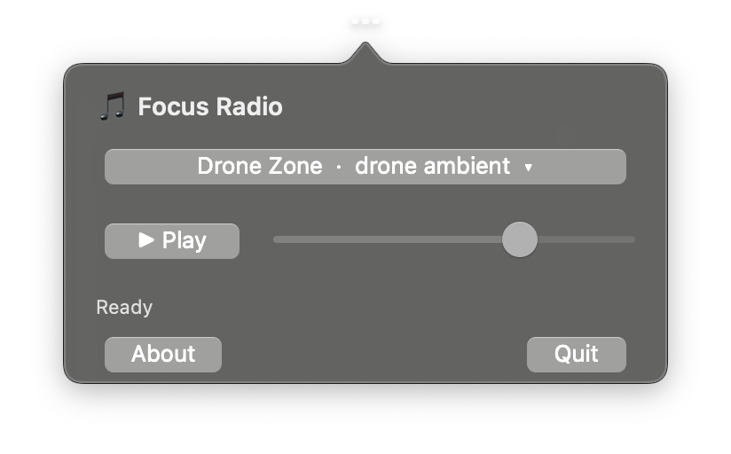
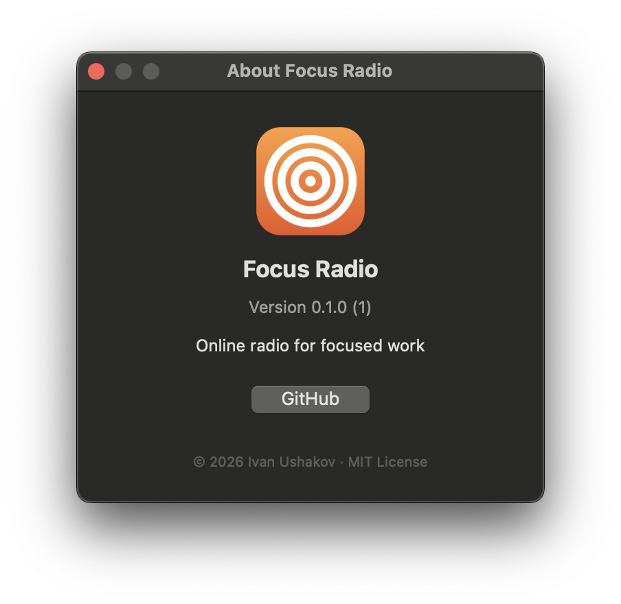

<!-- Languages: **English** · [Русский](README.ru.md) -->

<p align="center">
  
</p>

<h1 align="center">Focus Radio</h1>

<p align="center">
  A tiny macOS menu-bar radio player for deep-work sessions — SomaFM, Radio Paradise, NTS, Nightwave Plaza.
</p>

<p align="center">
  
  
  
</p>

---

Focus Radio lives in the menu bar and streams 18 curated stations for background listening:
ambient, space, jazz, mellow, downtempo, vaporwave. No accounts, no ads, no music library —
click, pick a station, get back to work.

## Features

- **Menu-bar only.** An animated equalizer icon and a compact popover — no Dock icon, no
  window management.
- **18 curated stations, four providers.** SomaFM (10 ambient / space / IDM / jazz channels),
  Radio Paradise (Mellow / Main / Global), NTS Mixtapes (Slow Focus / Low Key / Sheet Music /
  Expansions), and Nightwave Plaza (vaporwave / lo-fi). Every station is verified to actually
  stream, not just connect.
- **Station health indicator.** A colored dot next to the status line — green (playing),
  yellow (connecting), red (unreachable) — so you see at a glance if a stream isn't responding.
- **Bilingual.** English and Russian UI, chosen automatically by your system language.
- **Update check.** From the About window, an optional check against GitHub Releases —
  notify-only, no background downloads.
- **Robust fallback.** Per-URL watchdog → next URL → hardcoded snapshot → whole-station
  retry. Real-playback detection (bytes, `currentTime`) rather than trusting
  `timeControlStatus` alone.
- **System integration.** Registers with `MPRemoteCommandCenter`, so the physical
  Play/Pause key and the macOS Now Playing card work while a station is streaming.
- **Restores state.** Last station and volume come back on next launch.
- **Zero dependencies.** One Swift file (`radio.swift`), only system frameworks
  (AppKit, AVFoundation, MediaPlayer).

## Screenshots

Lives in the menu bar — the icon animates while a station is playing:



Click it for the station picker, play/pause, and volume:



About panel with version, license, and repository link:



## Install

1. Download `FocusRadio-<version>.dmg` from
   [Releases](https://github.com/Inhum/focus-radio/releases)
   (or build from source — see below).
2. Open the `.dmg` and drag **FocusRadio** to **Applications**.
3. The app isn't notarized, so on first launch macOS warns about an unidentified developer:
   System Settings → Privacy & Security → **Open Anyway**. After that it opens normally.

## Usage

- Click the menu-bar icon → popover opens with the station picker, play/pause, and volume.
- The icon animates while a station is playing.
- Play/Pause on your keyboard (the physical media key) toggles playback while Focus Radio
  is the active audio source. If you start Spotify or a YouTube tab, that app takes the
  media key — Focus Radio releases it.
- Click "About" for version / license / repository link. "Quit" exits the app.

## Build from source

Requirements: macOS 13+ and Command Line Tools (`xcode-select --install`). Full Xcode is
not needed.

```bash
git clone https://github.com/Inhum/focus-radio.git
cd focus-radio
./scripts/run.sh           # build (debug) + run with logs in the terminal
./scripts/build.sh         # build release → build/FocusRadio.app
./scripts/test.sh          # build + --test-all across every station
./scripts/package.sh       # build release + FocusRadio-<version>.dmg
./scripts/make-icon.sh     # regenerate Resources/FocusRadio.icns + docs/icon.png
```

## Data & network

Focus Radio has no backend, no telemetry, and no analytics. The only network calls it
makes are:

- `api.somafm.com` — refresh `.pls` playlists for SomaFM stations on launch.
- The direct stream endpoints listed in `stations` inside `radio.swift`.

Settings (last station index and volume) are stored via `UserDefaults` in
`~/Library/Preferences/com.ushakov.focus-radio.plist`. See [SECURITY.md](SECURITY.md) for
details and how to report vulnerabilities.

## Stations

Names and URLs of stations belong to their broadcasters. Focus Radio is an independent
client and is not affiliated with SomaFM, Radio Paradise, NTS, or Nightwave Plaza. If you enjoy any of
these stations, please support them directly — they're small, ad-free, listener-funded
operations.

## Contributing

Issues and pull requests are welcome — see [CONTRIBUTING.md](CONTRIBUTING.md). This is a
spare-time project, so responses may be slow and not every feature request will be accepted.

## Acknowledgements

Focus Radio was built largely with [Claude Code](https://claude.com/claude-code),
Anthropic's agentic coding tool, as an AI pair-programmer.

## License

[MIT](LICENSE) © 2026 Ivan Ushakov
